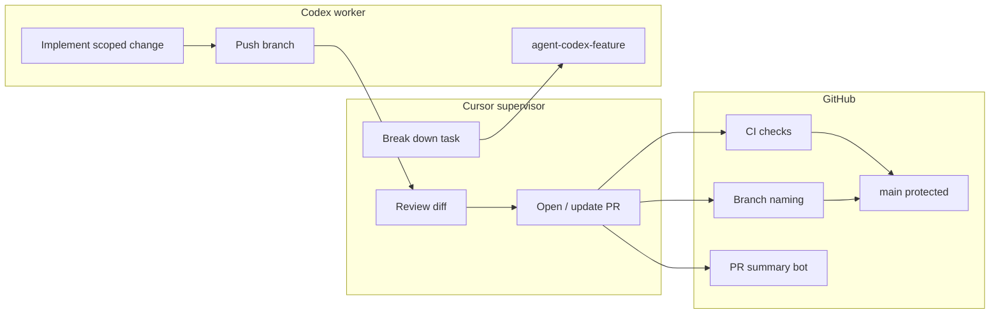
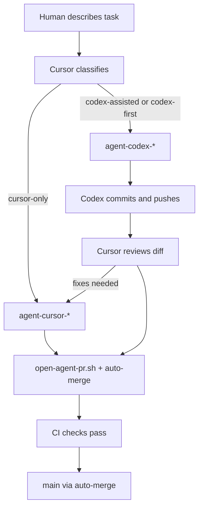

# Multi-agent AI workflow

Professional flow: **Cursor supervises**, **Codex builds**, **GitHub enforces** quality and branch rules.

## Architecture



## Rules

| Rule | Enforcement |
|------|-------------|
| No direct `main` pushes | Branch protection + local hooks |
| `agent-<agent>-<feature>` branches | `branch-naming.yml` on PRs |
| PR required | Branch protection |
| CI before merge | Required check **CI checks** |
| Commit prefixes | Convention + review |

## Task intake (plain English)

The human describes work in normal language. **Cursor classifies** before coding:

| Class | When |
|-------|------|
| **cursor-only** | Planning, architecture, security, UI judgment, ambiguity, risky areas |
| **codex-assisted** | Codex builds; Cursor reviews and may patch |
| **codex-first** | Plan is already clear; Codex implements; Cursor reviews before PR |

Cursor prints: `Classification: <class> — <one-line reason>`.

### What Cursor keeps

- Planning and architecture
- Reviewing Codex output
- UI/UX judgment
- Final PR summary and risk notes
- Security-sensitive or high-risk edits
- Auto-merge status reporting

### What Codex gets

- Isolated bug fixes, tests, refactors
- Repetitive multi-file edits
- Utility scripts, docs cleanup
- Small API/backend tasks from a **clear** Cursor plan

### What Codex must not get

- Secrets, auth, `middleware.ts` / env (unless task explicitly allows)
- Database migrations (unless human approves)
- Payments, major architecture, legal/compliance, Vercel/production config
- Vague tasks — Cursor plans first

### Decision table

| Task type | Owner |
|-----------|--------|
| Planning / architecture | Cursor |
| Simple implementation from clear plan | Codex |
| Tests | Codex |
| Review / final judgment | Cursor |
| Security / auth / secrets | Cursor only |
| Database migrations | Cursor only unless explicitly approved |
| UI polish | Cursor |
| Repetitive edits | Codex |

### Delegation flow



1. Classify and report.
2. If Codex: `./scripts/start-agent-task.sh codex <feature-slug>`.
3. Codex: `[codex]` commits only on its branch.
4. Cursor reviews; optional `agent-cursor-*` follow-up.
5. `./scripts/open-agent-pr.sh "[cursor|codex] summary"` → auto-merge when green.
6. Poll for merge → `./scripts/sync-main.sh` (or sync at next task start).
7. No direct `main` pushes; no `--admin`.

### Sync local `main`

```bash
./scripts/sync-main.sh
```

| Step | Action |
|------|--------|
| Safety | Abort if uncommitted changes exist |
| Fetch | `git fetch origin` + prune deleted remote branches |
| Update | `checkout main` → `pull --ff-only origin main` |
| Report | Latest commit hash + clean/dirty status |

**When it runs**

- Automatically before `start-agent-task.sh` creates a branch
- After `open-agent-pr.sh` detects PR merged (poll up to 600s)
- At the start of the next Cursor task if merge completed earlier
- After manual `merge-agent-pr.sh`

If auto-merge is still pending after timeout:

```text
Auto-merge is pending. Later, run ./scripts/sync-main.sh or ask Cursor to sync main.
```

## Starting work

### Cursor (supervisor) task

```bash
./scripts/start-agent-task.sh cursor my-feature   # syncs main first
./scripts/install-git-hooks.sh   # once per machine
# … implement or orchestrate …
git add -A && git commit -m "[cursor] short summary"
git push -u origin agent-cursor-my-feature
./scripts/agent-status.sh
./scripts/open-agent-pr.sh "[cursor] short summary"
# Enables GitHub auto-merge (squash, delete branch) when checks pass
```

### Codex (worker) task

Cursor creates the branch when delegation applies — the human does not need to say “use Codex.”

```bash
./scripts/start-agent-task.sh codex my-feature   # Cursor runs this when classifying codex-* 
```

Handoff brief for Codex:

```text
Branch: agent-codex-<feature> only.
Do not push to main. Do not merge.
Commit format: [codex] description.
When done: list files changed and tests run.
```

Cursor runs `./scripts/agent-status.sh`, reviews the diff, then opens the PR.

## Pull requests

1. Head branch must match `agent-(cursor|codex|name)-<feature>`.
2. Automated **PR summary** comment lists files and risk paths.
3. **CI checks** runs lint, typecheck, optional tests, build, audit.
4. **Vercel** preview for UI changes.
5. Cursor supervisor fills template: risks, rollback, screenshots.
6. **Auto-merge** when checks pass — enabled by `open-agent-pr.sh` (commit + push + PR implies approval).

## Auto-merge (default)

`./scripts/open-agent-pr.sh` creates the PR and runs:

```bash
gh pr merge <PR> --auto --squash --delete-branch
```

| Behavior | Detail |
|----------|--------|
| Merge timing | After required checks pass (CI checks, etc.) |
| Method | Squash merge only |
| Branch | Head branch deleted after merge |
| Protection | No `--admin`, no force merge, no direct push to `main` |
| Draft PRs | Auto-merge skipped; enable after marking ready |
| Repo setting | **Allow auto-merge** must be on (GitHub → Settings → General). `open-agent-pr.sh` enables it via API when admin. |

Cursor reports **PR link**, **check status**, and **auto-merge status** — do not ask for manual merge each time.

### Manual merge fallback

```bash
./scripts/merge-agent-pr.sh <PR_NUMBER>
```

Use only if auto-merge could not be enabled. Interactive Enter confirmation in a normal terminal.

## Commit messages

```text
[cursor] …
[codex] …
[docs] …
[system] …
```

## Local safety hooks

```bash
./scripts/install-git-hooks.sh
```

Installs:

- `pre-commit` — blocks commits on `main` / `master`
- `pre-push` — blocks pushes updating remote `main` / `master`

Templates live in `scripts/hooks/`.

## GitHub Actions

| File | Job name | Blocks merge? |
|------|----------|---------------|
| `.github/workflows/ci.yml` | CI checks | Yes (required) |
| `.github/workflows/branch-naming.yml` | Agent branch naming | Fails PR check |
| `.github/workflows/pr-summary.yml` | PR summary comment | Informational |

### CI steps

1. `npm ci`
2. `npm run lint`
3. `npm run typecheck`
4. `npm test` — **skipped** with notice if no `test` script in `package.json`
5. `npm run build`
6. `npm audit --audit-level=high` — warning only (`continue-on-error`)

### Optional AI PR summary

To add LLM-generated narrative (not required today):

1. Repo → **Settings** → **Secrets** → `OPENAI_API_KEY`
2. Extend `.github/workflows/pr-summary.yml` optional step (placeholder present)

Do not commit API keys.

## Human approval (optional, later)

Edit `scripts/setup-github-branch-protection.sh` and set:

```json
"required_approving_review_count": 1
```

Re-run the script as repo admin.

## Handoff checklist (Codex → Cursor)

- [ ] Branch pushed
- [ ] Commits use `[codex]`
- [ ] Files changed listed
- [ ] Tests/commands run listed
- [ ] No secrets in diff
- [ ] Cursor opened PR and verified CI

## Related docs

- [AGENTS.md](../AGENTS.md) — role summary for agents
- [CI_CD.md](./CI_CD.md) — branch protection and CI details
- [COLLABORATION.md](./COLLABORATION.md) — avoiding parallel edit conflicts
