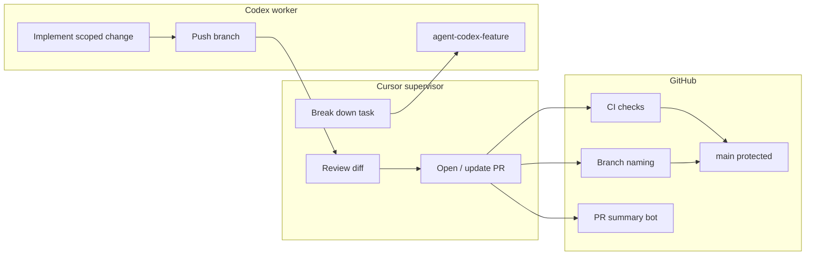

# Multi-agent AI workflow

Professional flow: **Cursor supervises**, **Codex builds**, **GitHub enforces** quality and branch rules.

## Architecture



## Rules

| Rule | Enforcement |
|------|-------------|
| No direct `main` pushes | Branch protection + local hooks |
| `agent-<agent>-<feature>` branches | `branch-naming.yml` on PRs |
| PR required | Branch protection |
| CI before merge | Required check **CI checks** |
| Commit prefixes | Convention + review |

## Starting work

### Cursor (supervisor) task

```bash
./scripts/start-agent-task.sh cursor my-feature
./scripts/install-git-hooks.sh   # once per machine
# … implement or orchestrate …
git add -A && git commit -m "[cursor] short summary"
git push -u origin agent-cursor-my-feature
./scripts/agent-status.sh
./scripts/open-agent-pr.sh "[cursor] short summary"
# Enables GitHub auto-merge (squash, delete branch) when checks pass
```

### Codex (worker) task

Give Codex explicit instructions:

```text
Branch: agent-codex-my-feature only.
Do not push to main. Do not merge.
Commit format: [codex] description.
When done: list files changed and tests run.
```

```bash
./scripts/start-agent-task.sh codex my-feature
# Codex works on that branch …
./scripts/agent-status.sh   # Cursor verifies before PR
```

## Pull requests

1. Head branch must match `agent-(cursor|codex|name)-<feature>`.
2. Automated **PR summary** comment lists files and risk paths.
3. **CI checks** runs lint, typecheck, optional tests, build, audit.
4. **Vercel** preview for UI changes.
5. Cursor supervisor fills template: risks, rollback, screenshots.
6. **Auto-merge** when checks pass — enabled by `open-agent-pr.sh` (commit + push + PR implies approval).

## Auto-merge (default)

`./scripts/open-agent-pr.sh` creates the PR and runs:

```bash
gh pr merge <PR> --auto --squash --delete-branch
```

| Behavior | Detail |
|----------|--------|
| Merge timing | After required checks pass (CI checks, etc.) |
| Method | Squash merge only |
| Branch | Head branch deleted after merge |
| Protection | No `--admin`, no force merge, no direct push to `main` |
| Draft PRs | Auto-merge skipped; enable after marking ready |

Cursor reports **PR link**, **check status**, and **auto-merge status** — do not ask for manual merge each time.

### Manual merge fallback

```bash
./scripts/merge-agent-pr.sh <PR_NUMBER>
```

Use only if auto-merge could not be enabled. Interactive Enter confirmation in a normal terminal.

## Commit messages

```text
[cursor] …
[codex] …
[docs] …
[system] …
```

## Local safety hooks

```bash
./scripts/install-git-hooks.sh
```

Installs:

- `pre-commit` — blocks commits on `main` / `master`
- `pre-push` — blocks pushes updating remote `main` / `master`

Templates live in `scripts/hooks/`.

## GitHub Actions

| File | Job name | Blocks merge? |
|------|----------|---------------|
| `.github/workflows/ci.yml` | CI checks | Yes (required) |
| `.github/workflows/branch-naming.yml` | Agent branch naming | Fails PR check |
| `.github/workflows/pr-summary.yml` | PR summary comment | Informational |

### CI steps

1. `npm ci`
2. `npm run lint`
3. `npm run typecheck`
4. `npm test` — **skipped** with notice if no `test` script in `package.json`
5. `npm run build`
6. `npm audit --audit-level=high` — warning only (`continue-on-error`)

### Optional AI PR summary

To add LLM-generated narrative (not required today):

1. Repo → **Settings** → **Secrets** → `OPENAI_API_KEY`
2. Extend `.github/workflows/pr-summary.yml` optional step (placeholder present)

Do not commit API keys.

## Human approval (optional, later)

Edit `scripts/setup-github-branch-protection.sh` and set:

```json
"required_approving_review_count": 1
```

Re-run the script as repo admin.

## Handoff checklist (Codex → Cursor)

- [ ] Branch pushed
- [ ] Commits use `[codex]`
- [ ] Files changed listed
- [ ] Tests/commands run listed
- [ ] No secrets in diff
- [ ] Cursor opened PR and verified CI

## Related docs

- [AGENTS.md](../AGENTS.md) — role summary for agents
- [CI_CD.md](./CI_CD.md) — branch protection and CI details
- [COLLABORATION.md](./COLLABORATION.md) — avoiding parallel edit conflicts
