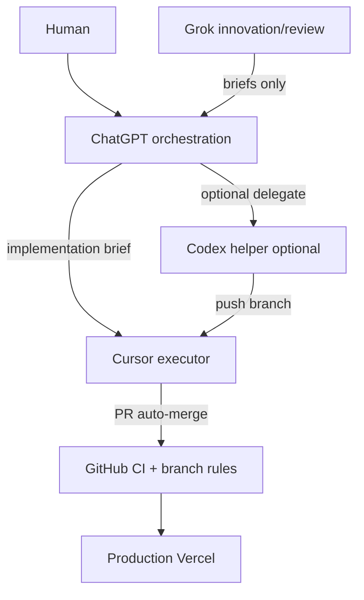
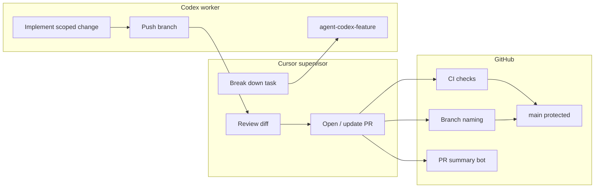
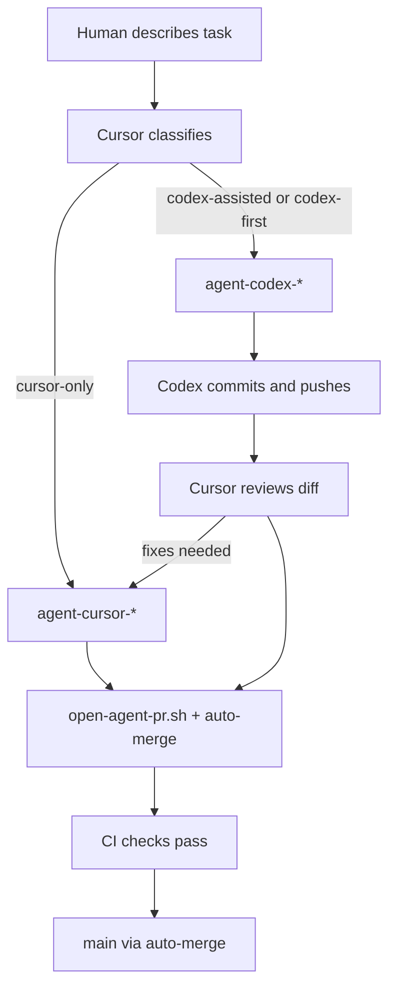

# Multi-agent AI workflow

Professional flow: **ChatGPT orchestrates**, **Cursor executes by default**, **Grok innovates/reviews (optional, no repo)**, **Codex helps when delegated**, **GitHub enforces** quality and branch rules.

**Safety philosophy:** Reliability over unchecked autonomy. No AI bypasses branch protection, CI, or deployment safety. No infinite autonomous loops.

See [AI_OPERATING_MODEL.md](./AI_OPERATING_MODEL.md), [GROK_REVIEW_MODEL.md](./GROK_REVIEW_MODEL.md), [AI_TASK_FLOW.md](./AI_TASK_FLOW.md).

## Architecture



**Default path:** Human → ChatGPT plan → Cursor on `agent-cursor-*` → PR → CI → auto-merge → `main`.

**Grok path:** Grok review → ChatGPT filter → Cursor (never Grok → repo directly).

## ChatGPT orchestration layer

ChatGPT does **not** push code. It:

- Classifies tasks (`cursor-only`, `codex-assisted`, `docs-only`)
- Produces implementation briefs for Cursor
- Filters Grok output (implement now / deferred / reject / clarify)
- Mediates risk, deployment reasoning, and scope

Templates: [prompts/chatgpt-orchestration-review.md](./prompts/chatgpt-orchestration-review.md)

## Grok innovation loop

- Use [prompts/grok-product-review.md](./prompts/grok-product-review.md) or [grok-feature-innovation.md](./prompts/grok-feature-innovation.md)
- Paste output into ChatGPT orchestration review before any coding
- Max 1–3 **implement now** items per cycle; avoid innovation spirals
- Details: [GROK_REVIEW_MODEL.md](./GROK_REVIEW_MODEL.md)

## Cursor default execution model

- All routine implementation on `agent-cursor-*`
- `./scripts/start-agent-task.sh cursor <slug>` → `agent-quick-check.sh` → `agent-finish.sh`
- Cursor **always** opens PRs (including after Codex or cloud worker commits)
- Intake template: [prompts/cursor-implementation-intake.md](./prompts/cursor-implementation-intake.md)

## Codex cloud delegation (Cursor Cloud / OpenAI Codex)

When Cursor classifies **codex-assisted** and the slice is large or parallel-friendly, delegate to a **cloud worker** on `agent-codex-*`. Cursor local keeps review and PR authority.

```text
Cursor local → delegate-codex-cloud.sh → brief + branch
    → Cursor Cloud or Codex (worker)
    → push [codex] to agent-codex-*
    → Cursor local review → agent-finish.sh → CI → auto-merge
```

| Step | Command / action |
|------|------------------|
| Prepare | `./scripts/delegate-codex-cloud.sh <slug>` |
| Edit brief | `.agent/delegation/codex-<slug>.md` |
| Cloud prompt | `./scripts/delegate-codex-cloud.sh <slug> --print-only` |
| Review | `agent-status.sh --pre-pr`, `agent-quick-check.sh` |
| Ship | `./scripts/agent-finish.sh "[cursor] … (codex-assisted)"` |

**When appropriate:** tests, docs, repetitive edits, isolated UI — Codex-safe paths with allow-list.  
**When not:** auth, middleware, API routes, migrations, ambiguous scope, high-risk without human ack.

Details: [CODEX_CLOUD_DELEGATION.md](./CODEX_CLOUD_DELEGATION.md) · [prompts/codex-cloud-delegation.md](./prompts/codex-cloud-delegation.md)  
Cloud env: `.cursor/environment.json`

## PR / CI governance & merge lifecycle

1. Head branch: `agent-(cursor|codex|name)-<feature>`
2. **CI checks** (required) + branch naming
3. PR summary bot (informational)
4. Auto-merge via `open-agent-pr.sh` / `agent-finish.sh` when green
5. No `--admin`, no force merge, no direct `main` push
6. Vercel deploys from `main` — agents do not trigger production APIs

**Review helpers:** `./scripts/ai-review-summary.sh` (paste for Grok/ChatGPT), `./scripts/ai-task-status.sh` (branch/PR/ownership).

---

## Legacy supervisor/worker diagram (Cursor + Codex)



## Rules

| Rule | Enforcement |
|------|-------------|
| No direct `main` pushes | Branch protection + local hooks |
| `agent-<agent>-<feature>` branches | `branch-naming.yml` on PRs |
| PR required | Branch protection |
| CI before merge | Required check **CI checks** |
| Commit prefixes | Convention + review |

## Task intake (plain English)

The human describes work in normal language. **Cursor classifies** before coding:

| Class | When |
|-------|------|
| **cursor-only** | Planning, architecture, security, UI judgment, ambiguity, risky areas |
| **codex-assisted** | Codex builds; Cursor reviews and may patch |
| **codex-first** | Deprecated default — prefer **cursor-only**; Codex only when Cursor delegates |

Cursor prints: `Classification: <class> — <one-line reason>`. ChatGPT may supply the brief; Cursor still owns execution and PR.

### What Cursor keeps

- Planning and architecture
- Reviewing Codex output
- UI/UX judgment
- Final PR summary and risk notes
- Security-sensitive or high-risk edits
- Auto-merge status reporting

### What Codex gets

- Isolated bug fixes, tests, refactors
- Repetitive multi-file edits
- Utility scripts, docs cleanup
- Small API/backend tasks from a **clear** Cursor plan

### What Codex must not get

- Secrets, auth, `middleware.ts` / env (unless task explicitly allows)
- Database migrations (unless human approves)
- Payments, major architecture, legal/compliance, Vercel/production config
- Vague tasks — Cursor plans first

### Ownership locking

| Cursor-owned | Codex-safe |
|--------------|------------|
| Architecture, routing, `middleware.ts` | Scoped components |
| Auth, security, Clerk, Supabase service wiring | Tests, utilities |
| `app/api/*`, `lib/env.ts`, `lib/didit.ts` | Docs cleanup (non-deploy) |
| Migrations / schema | Repetitive refactors |
| Vercel, env vars, production settings | Bug fixes with a clear plan |
| `.github/workflows/`, protection scripts | |

**Enforcement:** `./scripts/agent-status.sh --pre-pr` lists Cursor-owned paths. **Codex** PRs that touch them fail before `open-agent-pr.sh` continues. Cursor reviews all Codex PRs before merge.

**Conflict prevention:** clean tree → `start-agent-task.sh` → one writer per branch → `agent-status.sh --pre-pr` before PR.

### Decision table

| Task type | Owner |
|-----------|--------|
| Planning / architecture | Cursor |
| Simple implementation from clear plan | Codex |
| Tests | Codex |
| Review / final judgment | Cursor |
| Security / auth / secrets | Cursor only |
| Database migrations | Cursor only unless explicitly approved |
| UI polish | Cursor |
| Repetitive edits | Codex |

### Delegation flow



1. Classify and report.
2. If Codex: `./scripts/start-agent-task.sh codex <feature-slug>`.
3. Codex: `[codex]` commits only on its branch.
4. Cursor reviews; optional `agent-cursor-*` follow-up.
5. `./scripts/open-agent-pr.sh "[cursor|codex] summary"` → auto-merge when green.
6. `./scripts/agent-finish.sh` or `open-agent-pr.sh` enables auto-merge and **exits immediately** (use `--wait` to poll).
7. `./scripts/sync-main.sh` at next task start (or `--wait` after merge).
8. No direct `main` pushes; no `--admin`.

### Sync local `main`

```bash
./scripts/sync-main.sh
```

| Step | Action |
|------|--------|
| Safety | Abort if uncommitted changes exist |
| Fetch | `git fetch origin` + prune deleted remote branches |
| Update | `checkout main` → `pull --ff-only origin main` |
| Report | Latest commit hash + clean/dirty status |

**When it runs**

- Automatically before `start-agent-task.sh` creates a branch
- After `open-agent-pr.sh` detects PR merged (poll up to 600s)
- At the start of the next Cursor task if merge completed earlier
- After manual `merge-agent-pr.sh`

Default: no wait — merge finishes on GitHub in the background.

```text
./scripts/agent-finish.sh "[cursor] summary"
# → PR opened, auto-merge ON, agent returns in seconds
```

Optional: `./scripts/open-agent-pr.sh "…" --wait` polls up to 120s and may sync `main`.

## Starting work

### Cursor (supervisor) task

```bash
./scripts/start-agent-task.sh cursor my-feature   # syncs main first
./scripts/install-git-hooks.sh   # once per machine
# … implement or orchestrate …
git add -A && git commit -m "[cursor] short summary"
git push -u origin agent-cursor-my-feature
./scripts/agent-status.sh
./scripts/open-agent-pr.sh "[cursor] short summary"
# Enables GitHub auto-merge (squash, delete branch) when checks pass
```

### Codex (worker) task

Cursor creates the branch when delegation applies — the human does not need to say “use Codex.”

```bash
./scripts/start-agent-task.sh codex my-feature   # Cursor runs this when classifying codex-* 
```

Handoff brief for Codex:

```text
Branch: agent-codex-<feature> only.
Do not push to main. Do not merge.
Commit format: [codex] description.
When done: list files changed and tests run.
```

Cursor runs `./scripts/agent-status.sh`, reviews the diff, then opens the PR.

## Pull requests

1. Head branch must match `agent-(cursor|codex|name)-<feature>`.
2. Automated **PR summary** comment lists files and risk paths.
3. **CI checks** runs lint, typecheck, optional tests, build, audit.
4. **Vercel** preview for UI changes.
5. Cursor supervisor fills template: risks, rollback, screenshots.
6. **Auto-merge** when checks pass — enabled by `open-agent-pr.sh` (commit + push + PR implies approval).

## Auto-merge (default)

`./scripts/open-agent-pr.sh` creates the PR, enables auto-merge **immediately**, prints check status, and waits briefly:

```bash
gh pr merge <PR> --auto --squash --delete-branch
```

| Behavior | Detail |
|----------|--------|
| Merge timing | After **CI checks** pass on GitHub (not when the script exits) |
| Script wait | Default **0s** — exit immediately; merge continues on GitHub |
| Method | Squash merge only |
| Branch | Head branch deleted after merge |
| Protection | No `--admin`, no force merge, no direct push to `main` |
| Draft PRs | Auto-merge skipped; enable after marking ready |
| Repo setting | **Allow auto-merge** must be on. `open-agent-pr.sh` enables via API when admin. |

**End-of-task report** (printed by script): branch, commit, PR URL, checks, auto-merge yes/no, local `main` sync, manual step if any.

Cursor does not ask for routine manual merges.

### Manual merge fallback

```bash
./scripts/merge-agent-pr.sh <PR_NUMBER>
```

Use only if auto-merge could not be enabled. Interactive Enter confirmation in a normal terminal.

## Commit messages

```text
[cursor] …
[codex] …
[docs] …
[system] …
```

## Local safety hooks

```bash
./scripts/install-git-hooks.sh
```

Installs:

- `pre-commit` — blocks commits on `main` / `master`
- `pre-push` — blocks pushes updating remote `main` / `master`

Templates live in `scripts/hooks/`.

## GitHub Actions

| File | Job name | Blocks merge? |
|------|----------|---------------|
| `.github/workflows/ci.yml` | CI checks | Yes (required) |
| `.github/workflows/branch-naming.yml` | Agent branch naming | Fails PR check |
| `.github/workflows/pr-summary.yml` | PR summary comment | Informational |

### CI steps

| Path | What runs |
|------|-----------|
| Code changes | `npm ci` (cached) → lint + typecheck **in parallel** → tests (if script exists) → build → advisory audit |
| Docs/markdown only | Fast **CI checks** job (~30s), skips lint/build |

**Required for merge:** job named **CI checks** only. Branch naming is a separate required check. PR summary and Vercel are optional for speed.

### Optional AI PR summary

To add LLM-generated narrative (not required today):

1. Repo → **Settings** → **Secrets** → `OPENAI_API_KEY`
2. Extend `.github/workflows/pr-summary.yml` optional step (placeholder present)

Do not commit API keys.

## Human approval (optional, later)

Edit `scripts/setup-github-branch-protection.sh` and set:

```json
"required_approving_review_count": 1
```

Re-run the script as repo admin.

## Handoff checklist (Codex → Cursor)

- [ ] Branch pushed
- [ ] Commits use `[codex]`
- [ ] Files changed listed
- [ ] Tests/commands run listed
- [ ] No secrets in diff
- [ ] Cursor opened PR and verified CI

## Related docs

- [AGENTS.md](../AGENTS.md) — role summary for agents
- [AI_OPERATING_MODEL.md](./AI_OPERATING_MODEL.md) — ChatGPT / Grok / Cursor authority
- [GROK_REVIEW_MODEL.md](./GROK_REVIEW_MODEL.md) — safe Grok participation
- [CODEX_CLOUD_DELEGATION.md](./CODEX_CLOUD_DELEGATION.md) — Cursor Cloud / Codex worker delegation
- [AI_TASK_FLOW.md](./AI_TASK_FLOW.md) — issues, labels, idea → merge flow
- [CI_CD.md](./CI_CD.md) — branch protection and CI details
- [COLLABORATION.md](./COLLABORATION.md) — avoiding parallel edit conflicts
